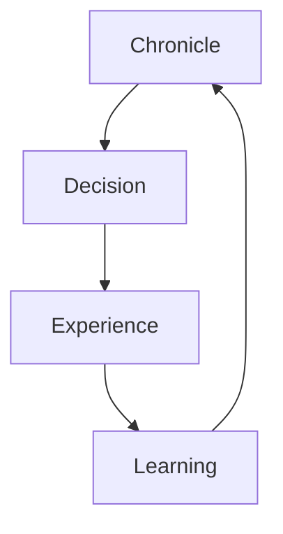

# Figures Plan

## 基本方針

図は本文の代替ではなく、本文で論証した関係を圧縮し、読者が全体構造を把握できるようにするために使用します。図だけで新しい主張を追加せず、本文から必ず参照します。各図には番号、タイトル、目的、対応章を付けます。

## Figure 1　企業存在論

企業を一時点の資産集合として見る従来像と、時間の中で意味・判断・関係・学習が連続するクロニクルとして見る提案像を対比します。

## Figure 2　履歴・Knowledge・Chronicleの差異

履歴は出来事の配列、Knowledgeは整理された事実、Chronicleは時間を通じて判断と意味が更新される動的構造であることを示します。

## Figure 3　Chronicleの自己更新循環

判断が経験を生み、学習を経てクロニクルが更新される循環を示します。

## Figure 4　Chronicle Capital

人的資本、知的資本、社会関係資本などが、時間と意味の連続性によって統合され、将来の価値創造能力として現れる関係を示します。

## Figure 5　Brainful Loop

クロニクルの理解、問いの設定、仮説、対話、試行、評価、学習、更新の循環を示します。特定のPDCA手法の置換ではなく、クロニクルを基盤にした学習循環として表現します。

## Figure 6　Brainful Protocol

企業、士業、金融機関、大学、自治体、AI・IT企業が中央組織へ従属するのではなく、共通原理を介して相互運用する構造を示します。

## Figure 7　Brainful Alliance

Brainful Protocolを共有する主体間に形成される実践共同体を示します。固定的な組織図ではなく、案件や地域によって構成が変化する分散協働構造として描きます。

## Figure 8　価値連鎖

Chronicleの理解から、学習、意思決定、変化対応能力、企業価値、地域価値へ至る価値連鎖を示します。因果関係を実証済みとして断定せず、提案モデルであることを図注に記載します。

## Figure 9　社会実装ロードマップ

Proposal、Pilot、Review、Protocol標準化、Alliance形成、地域展開の段階を、学習と修正が反復するロードマップとして示します。

## 制作規約

Mermaidを用いる場合は `proposal/AGENTS.md` の規約に従います。役員向けPDFでは、同じ論理構造をブランドカラーに基づく印刷品質の図へ再制作します。図中の矢印は因果、順序、相互作用を区別し、凡例を付けます。
